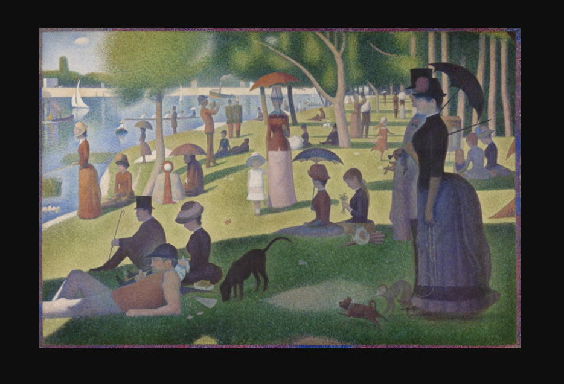
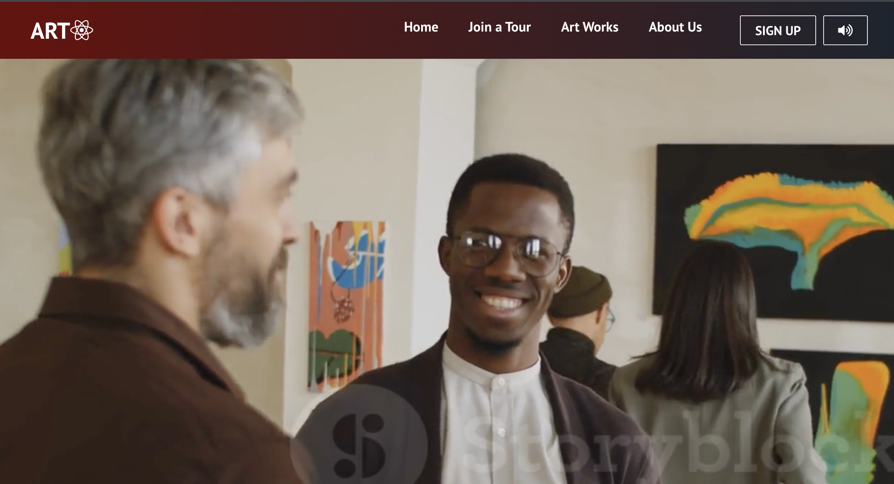
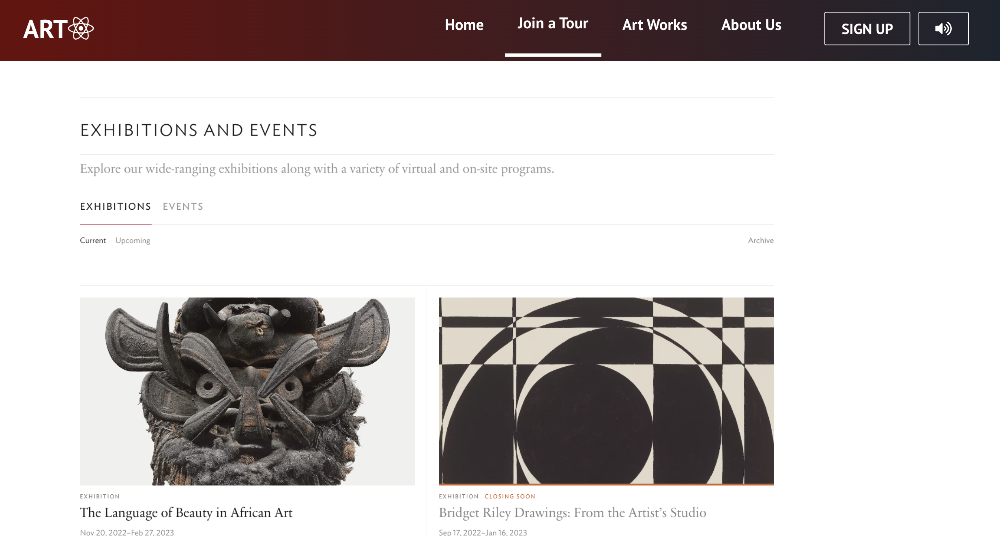
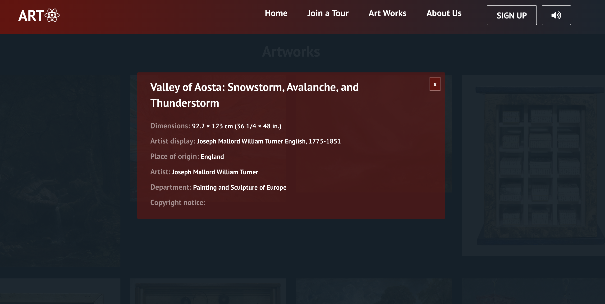
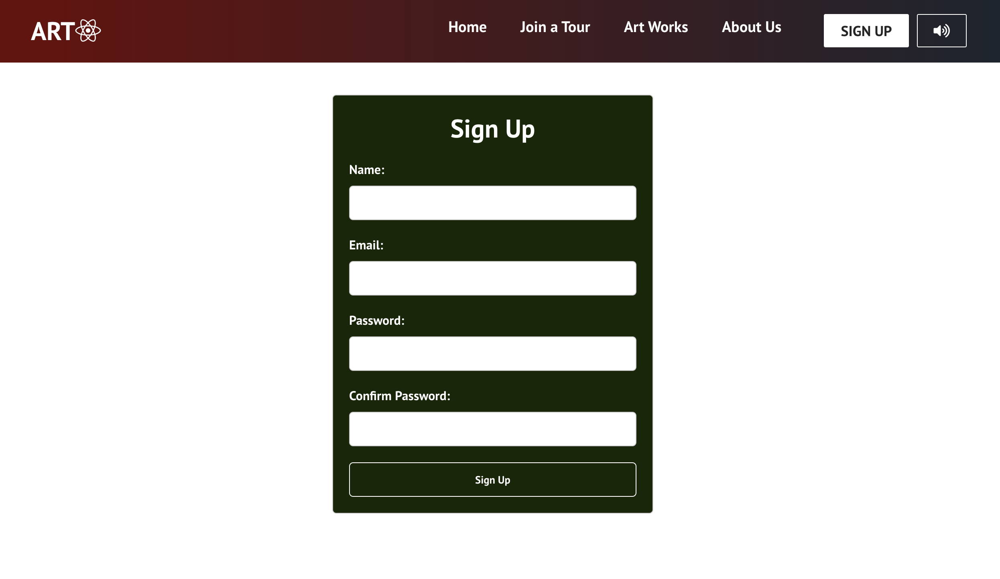
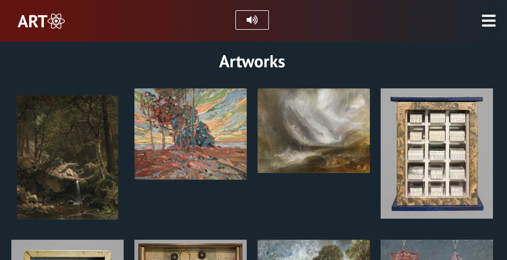
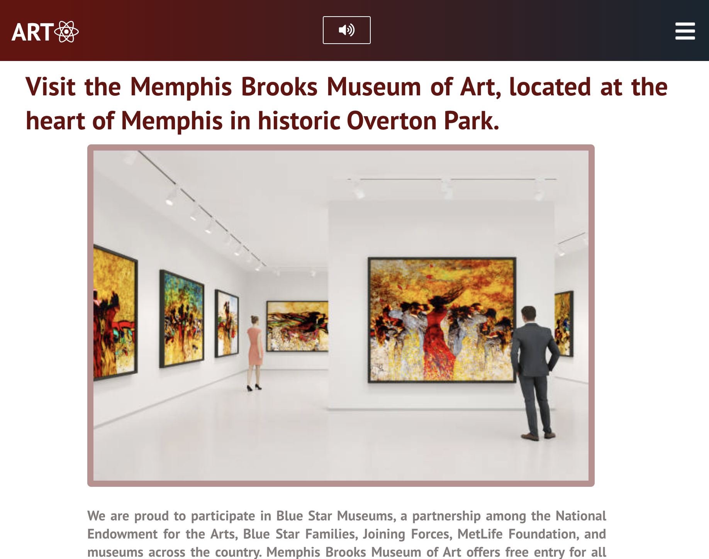

# API-UI project for Art Institute of Chicago

## Description

This project is a UI API for a virtual tour and art gallery. It allows users to
navigate through different tours and view artworks from a variety of artists.

- API of Art Institute of Chicago:
  [API of Art Institute of Chicago](https://api.artic.edu/docs/)
- GitHub Link
  [https://github.com/annadruzhinina/api-ui-pattern-art](https://github.com/annadruzhinina/api-ui-pattern-art)
- Deployment
  [https://rainbow-creponne-172444.netlify.app/](https://rainbow-creponne-172444.netlify.app/)

---

## API Navigation

---

### Access to the artworks listing endpoint in our API by visiting the following URL:

```json
https://api.artic.edu/api/v1/artworks
```

### Your response will look something like this:

```json
"data": [
{
"id": 262718,
"api_model": "artworks",
"api_link": "https://api.artic.edu/api/v1/artworks/262718",
"is_boosted": false,
"title": "Native Hosts for Chicago",
"alt_titles": null,
"thumbnail": {},
"main_reference_number": "2022.141a-c",
"has_not_been_viewed_much": true,
"boost_rank": null,
...
"image_id": "4fdd9b79-f8b9-af9b-4967-7fc1c3faefe6",
...
```

As you can see this API does not contain image files. Instead of this, you can
see image_id:

```json
...
"image_id": "4fdd9b79-f8b9-af9b-4967-7fc1c3faefe6",
...
```

### [API Documentation ](https://api.artic.edu/docs/). In section 'Images' you can see an example of how should be Image API

```json
https://www.artic.edu/iiif/2/{identifier}/full/843,/0/default.jpg
```

# Example:

### Retrieve one or more artworks with image_id fields. Here are a few ways of doing

so:

```js
# La Grande Jatte
https://api.artic.edu/api/v1/artworks/27992?fields=id,title,image_id
# La Grande Jatte and The Bedroom
https://api.artic.edu/api/v1/artworks?ids=27992,28560&fields=id,title,image_id
# Top two public domain artworks
https://api.artic.edu/api/v1/artworks/search?query[term][is_public_domain]=true&limit=2&fields=id,title,image_id
```

### In my project I used:

```json
# https://api.artic.edu/api/v1/artworks/27992?fields=id,title,image_id
```

1. Let's go with the first one, La Grande Jatte (opens new window). Your
   response will look something like this:

```json

"data": {
"id": 27992,
"title": "A Sunday on La Grande Jatte — 1884",
"image_id": "2d484387-2509-5e8e-2c43-22f9981972eb"
},
"info": {
...
"config": {
"iiif_url": "https://www.artic.edu/iiif/2",
```

2. Find the base IIIF Image API endpoint in the config.iiif_url field:

```json
https://www.artic.edu/iiif/2
```

3. Append the image_id of the artwork as a segment to this URL:

```json
https://www.artic.edu/iiif/2/1adf2696-8489-499b-cad2-821d7fde4b33
```

4. Append /full/843,/0/default.jpg to the URL:

```json
https://www.artic.edu/iiif/2/1adf2696-8489-499b-cad2-821d7fde4b33/full/843,/0/default.jpg
```

5. Result

<div style="text-align:center"></div>

# About website [ArtGallery](https://rainbow-creponne-172444.netlify.app/)

# Features

### - Logo: The logo on the top-left corner of the page is clickable and redirects the user to the Home page.

<div style="text-align:center"></div>

### - Join a Tour: This feature allows users to join a virtual tour and view artworks from different artists. A picture has been added to provide a visual representation of this feature.

In Progress...

<div style="text-align:center"></div>

### - Art Works: The 'Art Works' section displays pictures from an API. If a user clicks on a picture, a popup window will appear with additional information about the artwork which comes from API.

<div style="text-align:center"></div>
<div style="text-align:center"></div>

### - About Us: This section provides some information about the art gallery.

<div style="text-align:center"></div>

### - Sign up: Users can sign up on the website by filling out a form that includes fields for name, email, password, and confirm password.

<div style="text-align:center"></div>

### - Responsive Design: The navigation bar transforms into a hamburger menu when the size of the window is less than 960px.

<div style="text-align:center"></div>

<div style="text-align:center"></div>

---

# Future Features

- Search: A search feature that allows users to search for specific artworks or
  tours.

- Filter: A filter feature that allows users to filter artworks by artist,
  medium, or date.

- Social Media Integration: Integration with social media platforms such as
  Facebook, Instagram, and Twitter to share artworks and tours.

- User Profiles: A user profile feature that allows users to save their favorite
  artworks and tours.

- Review System: A review system that allows users to leave feedback on artworks
  and tours.
